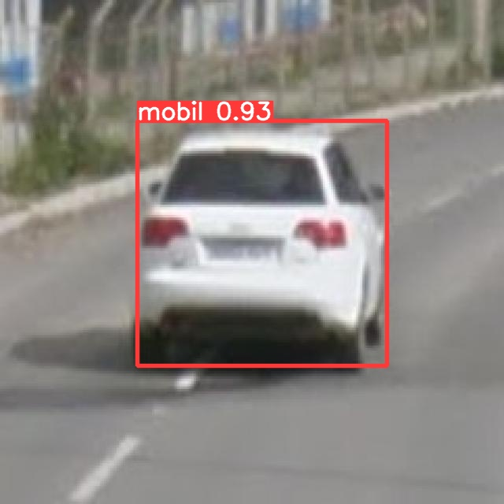
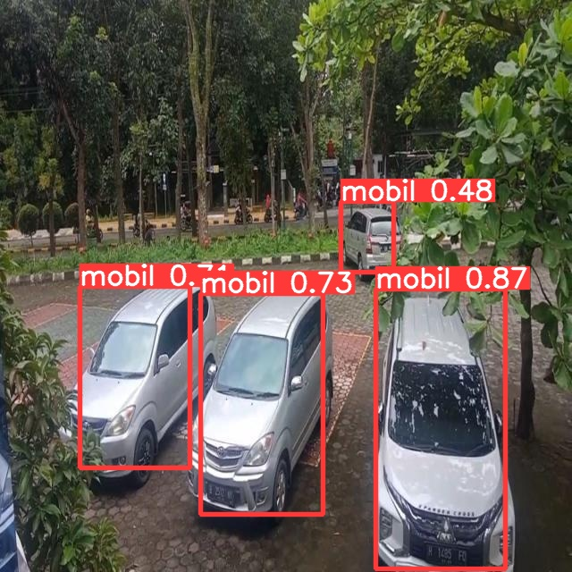

# SPARK (Space Parking Analyzer with Real-time Knowledge)

## Project Description
(Space Parking Analyzer with Real-time Knowledge) is a project that aims to develop an intelligent system that can detect and analyze empty parking spaces. In a dense urban environment, finding a parking space can be a challenging and time-consuming task. SPARK is designed to provide an efficient, real-time solution to address these problems by leveraging computer vision and artificial intelligence technologies. uses YOLO as Object Detection modeling which will be applied to application projects, but there are several modifications made to the architecture, with the aim of developing a model that is more efficient, precise and lighter.

* YOLOV5-ti-lite is a version of YOLOV5 from TI for efficient edge deployment. This naming convention is chosen to avoid conflict with future release of YOLOV5-lite models from Ultralytics.

* Here is a brief description of changes that were made to get yolov5-ti-lite from yolov5:
    * YOLOV5 introduces a Focus layer as the very first layer of the network. This replaces the first few heavy convolution layers that are present in YOLOv3. It reduces the complexity of the n/w by 7% and training time by 15%. However, the slice operations in Focus layer are not embedded friendly and hence we replace it with a light-weight convolution layer. Here is a pictorial description of the changes from YOLOv3 to YOLOv5 to YOLOv5-ti-lite:
    <p align="center"></p>     

    * SiLU activation is not well-supported in embedded devices. it's not quantization friendly as well because of it's unbounded nature. This was observed for hSwish activation function while [quantizing efficientnet](https://blog.tensorflow.org/2020/03/higher-accuracy-on-vision-models-with-efficientnet-lite.html). Hence, SiLU activation is replaced with ReLU.
    * SPP module with maxpool(k=13, s=1), maxpool(k=9,s=1) and maxpool(k=5,s=1) are replaced with various combinations of maxpool(k=3,s=1).Intention is to keep the receptive field and functionality same. This change will cause no difference to the model in floating-point.
        *	maxpool(k=5, s=1) -> replaced with two maxpool(k=3,s=1)
        *	maxpool(k=9, s=1) -> replaced with four maxpool(k=3,s=1) 
        *   maxpool(k=13, s=1)-> replaced with six maxpool(k=3,s=1) as shown below:
        <p align="center"></p> 
        
    * Variable size inference is replaced with fixed size inference as preferred by edge devices. E.g. tflite models are exported with a fixed i/p size.


## Contributor
| Full Name | Affiliation | Email | LinkedIn | Role |
| --- | --- | --- | --- | --- |
| M. Haswin Anugrah Pratama | Startup Campus, AI Track | ... | [link](https://www.linkedin.com/in/haswinpratama/) | Supervisor |
| Muhammad Fathurrahman | Universitas Negeri Semarang | fathur.031207@gmail.com | [link](https://www.linkedin.com/in/muhammad-fathurrahman-3254781aa/) | Team Lead |
| Arya Gagasan | Universitas Negeri Jakarta | aryagagas56@gmail.com | [link](https://www.linkedin.com/in/aryagagas/) | Team Member |
| Fiya Niswatus Sholihah | Universitas Airlangga | fiyaniswatussholihah@gmail.com | [link](https://www.linkedin.com/in/fiya-niswatus-sholihah-89797a21a/) | Team Member |
| Laily Farkhah Adhimah | Universitas Amikom Purwokerto | lailyfarkhaha@gmail.com | [link](https://www.linkedin.com/in/laily-farkhah-adhimah-13b953257/) | Team Member |
| Hendri Permana Putra | STMIK Triguna Dharma | hendripermana60@gmail.com | [link](https://www.linkedin.com/in/hendri-permana-putra-7399b0131/) | Team Member |
| Muhammad Adib Ardianto | Universitas Muria Kudus | Adibardianto21@gmail.com | [link](https://www.linkedin.com/notifications/?filter=all) | Team Member |


## Setup
### Prerequisite Packages (Dependencies)
- pandas==2.1.0
- openai==0.28.0
- google-cloud-aiplatform==1.34.0
- google-cloud-bigquery==3.12.0
- matplotlib>=3.2.2
- numpy
- opencv-python
- Pillow>=7.1.2
- PyYAML>=5.3.1
- requests>=2.23.0
- scipy
- tqdm>=4.64.0
- protobuf<4.21.3  # https://github.com/ultralytics/yolov5/issues/8012
- seaborn>=0.11.0
- ipython  # interactive notebook
- psutil  # system utilization
- thop  # FLOPs computation
- streamlit
- wget
- ffmpeg-python
- streamlit_webrtc
- torch

### Environment
| | |
| --- | --- |
| CPU | HP 240 G7 Notebook intel i5, 8-core CPU |
| GPU | Intel(R) UHD Graphics |
| ROM | 512 GB |
| RAM | 8 GB |
| OS | Windows 11 |
| Another Environment | Google Colab for Train |

## Dataset
The dataset collection process was carried out through a collective effort that involved taking photos from various sources, including images found on the internet, videos from the YouTube platform, and photos taken directly using a camera. In order to provide an overview, we include an example of one of the images that has been collected, which includes photos obtained online or through direct shooting.

### Example Image for Dataset
| | | |
| --- | --- | --- |
| <p align="center"></p> | <p align="center"></p> | <p align="center"></p> |
| <p align="center"></p> | <p align="center"></p> | <p align="center"></p> |

## Results
### Model Performance
Fundamentally, YOLOv5 has achieved very outstanding performance and has become very powerful in its official version. However, our exploration results show that when we made adjustments to the head and backbone in the layer configuration and parameters, we managed to achieve significant improvements in accuracy and more efficient model performance when running. This was primarily done by focusing the changes on the specific task we wanted to work on, namely car detection. We have directed the modifications towards improving the focus and SPP (Spatial Pyramid Pooling) module, aiming to ensure that our model provides optimal results and efficiently handles the task specifications.

### Adding Parameters tuning for enhance model (adding to configuration yaml)
<p align="center"></p>

## Training Configuration Parameters

### Optimizer
- **type**: Specifies the optimizer type, and in this case, it's set to Adam.
  - **lr (Learning Rate)**: Determines the step size at each iteration while moving toward a minimum of the loss function.
  - **weight_decay**: Controls the amount of regularization applied to the model by penalizing large weights.

### Learning Rate Scheduler
- **type**: Specifies the learning rate scheduler type. Here, it employs Cosine Annealing with Warm Restarts.
  - **T_0 (Initial Restart Period)**: Represents the number of epochs before a restart in the learning rate schedule.
  - **T_mult (Multiplier for Next Restart Period)**: Multiplier applied to the initial restart period for subsequent restarts.
  - **eta_min (Minimum Learning Rate)**: Defines the minimum value the learning rate can reach.

### Data Augmentation
- **train_mosaic**: A boolean indicating whether to utilize the mosaic data augmentation technique during training. Mosaic combines multiple images to form a single training sample.
- **train_mixup**: Determines the probability of applying mixup, a data augmentation technique that interpolates images and labels with other images and labels.

### Weight Initialization
- **initialize**: Specifies the weight initialization method used at the start of training.
  - **type**: Indicates the initialization method. In this case, it's set to kaiming_uniform_, which refers to He initialization.

These parameters play a crucial role in shaping the training process and influencing the performance of the deep learning model. Adjusting them carefully can lead to better convergence and generalization. 


### Change Head and Backbone
| YOLOv5 Official | YOLOv5-lite (Modification) |
| --- | --- |
| <p align="center"></p> | <p align="center"></p> |


#### 1. Metrics

| model | epoch | learning_rate | batch_size | optimizer | val_loss | val_precision | val_recall | mAP.0,5 | mAP.0,5:0,95 |
| --- | --- | --- | --- | --- | --- | --- | --- | --- | --- |
| yolov5s-lite | 100 |  0.001 | 64 | Adam | 0.0059 | 92.82% | 89.85% | 93.44% | 67.74% |
| yolov5s-lite | 300 | 0.001 | 64 | Adam | 0.0037 | 94.29% | 90.47% | 95.29% | 75.20% |
| ... | ... | ... | ... | ... | ... | ... | ... | ... | ... | ... |

#### 2. Ablation Study
In this segment, we carefully detail the series of layers that we applied during our experiments, with the main goal of achieving the most optimal accuracy results. As a first step, we will provide an in-depth explanation of the terms and symbols that we will use in the explanation in this section. This is done with the intention that readers have a better understanding before entering a detailed explanation regarding the layer configuration in our experiments.
- f = filter
- k = kernel 
- s = stride
- p = parameter

#### Backbone
| no. ablation | model | layer 1 | layer 2 | layer 3 | layer 4 | layer 5 | layer 6 | layer 7 | layer 8 | layer 9 | layer 10 |
| --- | --- | -------- | -------- | -------- | -------- | -------- | -------- | -------- | -------- | -------- | -------- | 
| 1. | yolov5s | Focus(k=3, f=64) | Conv(k=3, f=128, s=2) | C3(f=128) | Conv(f=256, k=3, s=2) | C3(f=256) | Conv(f=512, k=3, s=2) | C3(f=512) | Conv(f=1024, k=3, s=2) | SPP(f=1024, k=(5, 9, 13)) | C3(f=1024, p=False] |
| 2. | yolov5s | Focus(k=3, f=64) | Conv(k=3, f=128, s=2) | BottleneckCSP(f=128) | Conv(f=256, k=3, s=2) | GhostBottleneck(f=256) | GhostConv(f=512, k=3, s=2) | GhostBottleneck(f=512) | GhostConv(f=1024, k=3, s=2) | SPP(f=1024, k=(5, 9, 13)) | BottleneckCSP(f=1024, p=False] |
| last | yolov5s | Focus(k=3, f=64) | Conv(k=3, f=128, s=2) | BottleneckCSP(f=128) | Conv(f=256, k=3, s=2) | BottleneckCSP(f=256) | GhostConv(f=512, k=3, s=2) | BottleneckCSP(f=512) | GhostConv(f=1024, k=3, s=2) | SPP(f=1024, k=(5, 9, 13)) | BottleneckCSP(f=1024, p=False] |


#### Head
| no. ablation | model | layer 1 | layer 2 | layer 3 | layer 4 | layer 5 | layer 6 | layer 7 | layer 8 | layer 9 | layer 10 | layer 11 | layer 12 | layer 13 | layer 14 | layer 15 |
| --- | --- | -------- | -------- | -------- | -------- | -------- | -------- | -------- | -------- | -------- | -------- | -------- | -------- | -------- | -------- | -------- |
| 1. | yolov5s | Conv, [512, 1, 1] | nn.Upsample, [None, 2, 'nearest'] | Concat, [1] | C3, [512, False] | Conv, [256, 1, 1] | nn.Upsample, [None, 2, 'nearest'] | Concat, [1] | C3, [256, False] | Conv, [256, 3, 2] | Concat, [1] | C3, [512, False] | Conv, [512, 3, 2] | Concat, [1] | C3, [1024, False] | [17, 20, 23], 1, Detect, [nc, anchors] |
| 2. | yolov5s | Conv, [512, 1, 1] | nn.Upsample, [None, 2, 'nearest'] | Concat, [1] | BottleneckCSP, [512, False] | Conv, [256, 1, 1] | nn.Upsample, [None, 2, 'nearest'] | Concat, [1] | BottleneckCSP, [256, False] | Conv, [256, 3, 2] | Concat, [1] | GhostBottleneck, [512, False] | Conv, [512, 3, 2] | Concat, [1] | GhostBottleneck, [1024, False] | [17, 20, 23], 1, Detect, [nc, anchors] |
| last | yolov5s | Conv, [512, 1, 1] | nn.Upsample, [None, 2, 'nearest'] | Concat, [1] | BottleneckCSP, [512, False] | Conv, [256, 1, 1] | nn.Upsample, [None, 2, 'nearest'] | Concat, [1] | BottleneckCSP, [256, False] | GhostConv, [256, 3, 2] | Concat, [1] | BottleneckCSP, [512, False] | GhostConv, [512, 3, 2] | Concat, [1] | BottleneckCSP, [1024, False] | [17, 20, 23], 1, Detect, [nc, anchors] |

#### Precision and Validate
Berikut hasil yang didapat dari setiap pengujian dari ablasi pertama / percobaan pertama hingga final model, dengan epoch 300 :
| no. ablation | model | val_precision | val_recall |
| --- | --- | --- | --- |
| 1. | yolov5s-lite | 93.10% | 88.85% | 
| 2. | yolov5s-lite | 89.68% | 86.57% |
| last | yolov5s-lite | 94.29% | 90.47% |

#### 3. Training/Validation Curve
Insert an image regarding your training and evaluation performances (especially their losses). The aim is to assess whether your model is fit, overfit, or underfit.
* Training any model using this repo will take the above changes by default. Same commands as the official one can be used for training models from scartch. E.g.
  ```
  python train.py --data coco.yaml --cfg yolov5s6.yaml --weights '' --batch-size 64
  ```

* Results after training :

| Epochs 100 | Epochs 300 |
| --- | --- |
| <p align="center"></p> | <p align="center"></p> |
 
### Testing
Show some implementations (demos) of this model. Show **at least 10 images** of how your model performs on the testing data.

  ```
  python detect.py --weights /content/YOLO_TSIXV/runs/train/weights/best.pt --img 256 --conf 0.4 --source pathImages
  ```

* Results Image Detection :
  
| img | img | img |
| --- | --- | --- |
| <p align="center"></p> | </p> | </p> |
| <p align="center"></p> | </p> | </p> |
| <p align="center"></p> | </p> | </p> |
| <p align="center"></p> | </p> | </p> |

### Deployment (Optional)
Describe and show how you deploy this project (e.g., using Streamlit or Flask), if any.


## Supporting Documents
### Presentation Deck
- Link: [Our Presentation Deck TSixV](https://..)

### Business Model Canvas
Provide a screenshot of your Business Model Canvas (BMC). Give some explanations, if necessary.
<details>
  <summary>Click for See our BMC</summary>
  
  
</details>

### Short Video
Provide a link to your short video, that should includes the project background and how it works.
- Link: https://...

## References
Provide all links that support this final project, i.e., papers, GitHub repositories, websites, etc.
- Link: [Official YOLOV5 repository](https://github.com/ultralytics/yolov5/)
- Link: [yolov5-improvements-and-evaluation, Roboflow](https://blog.roboflow.com/yolov5-improvements-and-evaluation/)
- Link: [Focus layer in YOLOV5]( https://github.com/ultralytics/yolov5/discussions/3181)
- Link: [CrossStagePartial Network](https://github.com/WongKinYiu/CrossStagePartialNetworkss)
- Link: [CSPNet: A new backbone that can enhance learning capability of cnn](https://arxiv.org/abs/1911.11929)
- Link: [Path aggregation network for instance segmentation](https://arxiv.org/abs/1803.01534)
- Link: [Efficientnet-lite quantization](https://blog.tensorflow.org/2020/03/higher-accuracy-on-vision-models-with-efficientnet-lite.html)
- Link: [YOLOv5 Training video from Texas Instruments](https://training.ti.com/process-efficient-object-detection-using-yolov5-and-tda4x-processors)

## Additional Comments
1. The model development process in YOLOv5s has improved as far as precision and accuracy, but we recognize the potential to continue optimizing these models. We feel that by applying custom convolutional layers that have been tested a lot out there, both on the backbone and the head, we can achieve further improvements in prediction quality.

2. The integration of GhostConv and BottleneckCSP became an integral part of our approach to achieving a lighter model. Our main focus was to ensure the model could perform well in the car detection task, which was the main focus of our project. Although this model has provided satisfactory results for car detection, we realize that this implementation may be less effective when faced with more complex object detection tasks. Therefore, further exploration of these layers is expected to provide a deeper understanding of their potential and limitations.

## Citation
```
@inproceedings{ghostnet,
  title={GhostNet: More Features from Cheap Operations},
  author={Han, Kai and Wang, Yunhe and Tian, Qi and Guo, Jianyuan and Xu, Chunjing and Xu, Chang},
  booktitle={CVPR},
  year={2020}
}
@inproceedings{tinynet,
  title={Model Rubik’s Cube: Twisting Resolution, Depth and Width for TinyNets},
  author={Han, Kai and Wang, Yunhe and Zhang, Qiulin and Zhang, Wei and Xu, Chunjing and Zhang, Tong},
  booktitle={NeurIPS},
  year={2020}
}
@inproceedings{tnt,
  title={Transformer in transformer},
  author={Han, Kai and Xiao, An and Wu, Enhua and Guo, Jianyuan and Xu, Chunjing and Wang, Yunhe},
  booktitle={NeurIPS},
  year={2021}
}
@inproceedings{legonet,
  title={LegoNet: Efficient Convolutional Neural Networks with Lego Filters},
  author={Yang, Zhaohui and Wang, Yunhe and Liu, Chuanjian and Chen, Hanting and Xu, Chunjing and Shi, Boxin and Xu, Chao and Xu, Chang},
  booktitle={ICML},
  year={2019}
}
@inproceedings{wang2018learning,
  title={Learning versatile filters for efficient convolutional neural networks},
  author={Wang, Yunhe and Xu, Chang and Chunjing, XU and Xu, Chao and Tao, Dacheng},
  booktitle={NeurIPS},
  year={2018}
}
@inproceedings{tang2021augmented,
  title={Augmented shortcuts for vision transformers},
  author={Tang, Yehui and Han, Kai and Xu, Chang and Xiao, An and Deng, Yiping and Xu, Chao and Wang, Yunhe},
  booktitle={NeurIPS},
  year={2021}
}
@inproceedings{tang2022image,
  title={An Image Patch is a Wave: Phase-Aware Vision MLP},
  author={Tang, Yehui and Han, Kai and Guo, Jianyuan and Xu, Chang and Li, Yanxi and Xu, Chao and Wang, Yunhe},
  booktitle={CVPR},
  year={2022}
}
@inproceedings{han2022vig,
  title={Vision GNN: An Image is Worth Graph of Nodes}, 
  author={Kai Han and Yunhe Wang and Jianyuan Guo and Yehui Tang and Enhua Wu},
  booktitle={NeurIPS},
  year={2022}
}
@article{tang2022ghostnetv2,
  title={GhostNetV2: Enhance Cheap Operation with Long-Range Attention},
  author={Tang, Yehui and Han, Kai and Guo, Jianyuan and Xu, Chang and Xu, Chao and Wang, Yunhe},
  journal={arXiv preprint arXiv:2211.12905},
  year={2022}
}
```

## License
For academic and non-commercial use only.

## Acknowledgement
This project entitled <b>"SPARK (Space Parking Analyzer with Real-time Knowledge)"</b> is supported and funded by Startup Campus Indonesia and Indonesian Ministry of Education and Culture through the "**Kampus Merdeka: Magang dan Studi Independen Bersertifikasi (MSIB)**" program.
